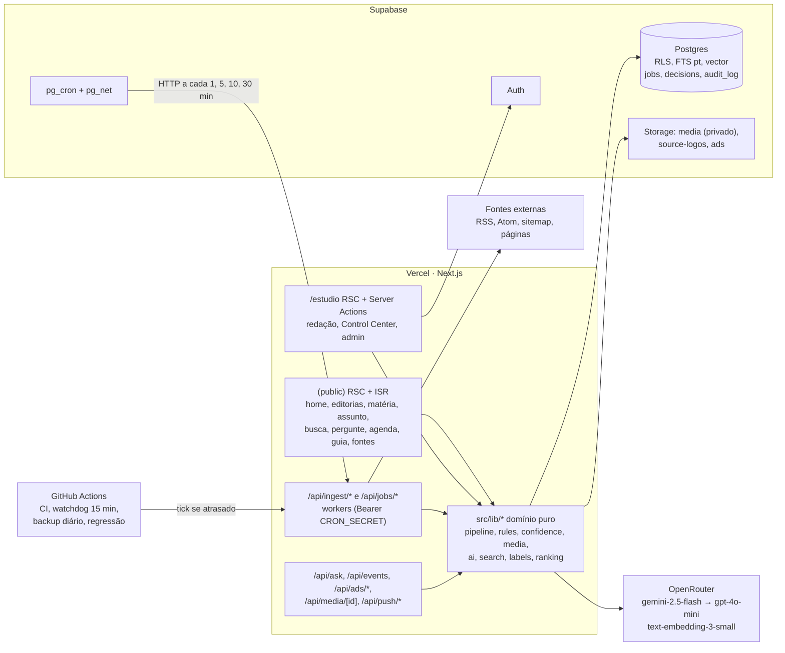
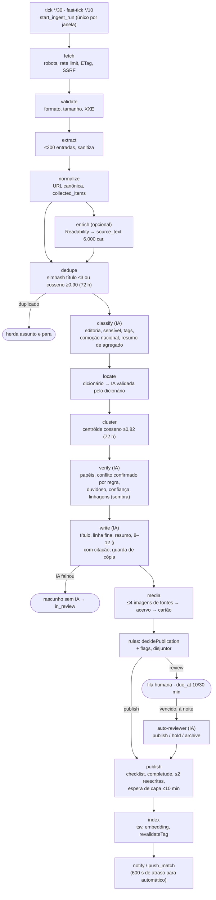

# Arquitetura atual (como construída)

Data: 04/10/2026. Retrato do que o código faz, não do que os planos previam. `docs/architecture.md` continua o documento normativo (ADRs 001 a 009); onde ele diverge da implementação, a divergência está na §7 abaixo e foi anotada lá. Legenda [O]/[I]/[R] em `AUDIT-REPORT.md`.

## 1. Inventário técnico

| Camada | Tecnologia | Evidência |
|---|---|---|
| Aplicação | Next.js 16.3.6 (App Router, RSC, Server Actions), React 19.2, TypeScript strict | `package.json` |
| Estilo | Tailwind CSS v4, tokens em `src/styles/tokens.css`, ESLint bloqueia hex/px em `src/components` | `eslint.config.mjs:18-40` |
| Dados | Supabase Postgres 17 (Auth, RLS, Storage), `vector`, `unaccent`, `pg_trgm`, `pgcrypto`; `pg_cron` e `pg_net` quando disponíveis | `0001_init.sql:2-4`, `0004_pipeline.sql:15-25`, `backup.yml` (PG 17) |
| Fila | Tabela própria `jobs` com `FOR UPDATE SKIP LOCKED`; `pgmq` instalado mas **não usado** | [O] `0004_pipeline.sql:31-215` |
| IA | Vercel AI SDK 7 + `@ai-sdk/openai-compatible` apontando para OpenRouter; provedor falso em teste | `src/lib/ai/openrouter.ts:43`, `src/lib/ai/fake.ts` |
| Mídia | `sharp` só para medir (dHash, nitidez, dimensões); bucket privado `media` servido por URL assinada | `src/lib/media/analyze.ts`, `src/lib/media/serve.ts` |
| Push | `web-push` + PWA (`src/sw`) | `src/lib/push/*` |
| Testes | Vitest (projetos unit, scripts, integration, security), Playwright (desktop, mobile, webkit), axe, Lighthouse CI | `vitest.config.mts:15-45`, `.github/workflows/ci.yml` |
| Hospedagem | Vercel (integração Git; sem `vercel.json`, sem Vercel Cron) | [I] `drain/route.ts:8` |
| Agendamento | `pg_cron` + `pg_net` chamando as rotas com `Bearer CRON_SECRET` do Vault; watchdog no GitHub Actions a cada 15 min | `0011_source_admin.sql:1072-1093`, `cron-watchdog.yml` |

Tamanho: cerca de 1.017 arquivos TS/TSX de produção em `src`, 304 testes unitários ao lado do código, 85 de integração, 81 migrations (numeração 0001 a 0150 com lacunas).

## 2. Componentes

## 3. Estrutura de diretórios e responsabilidades

| Pasta | Responsabilidade |
|---|---|
| `src/app/(public)` | Cerca de 45 rotas públicas: notícia, assunto, editoria, busca, Pergunte, agenda, guia, fontes, conta, institucionais (inventário em `docs/screens.md`; avaliação de UX em `EDITORIAL-INTELLIGENCE.md` §7) |
| `src/app/estudio` | Redação (fila, matérias, versões, correções, mídia, denúncias), Control Center (`control/*`: tempo real, fontes, regras, falhas, execuções, logs, custos, agentes, modelos, prompts, avaliações, governança), admin (usuários, papéis, taxonomia, home, destaques, publicidade, SEO, auditoria, interruptores, contingência, push, guia) |
| `src/app/api` | Workers do pipeline, busca com IA, eventos, mídia, anúncios, push, newsletter, ICS |
| `src/lib/pipeline` | Fila, drain, tick, etapas (`steps/*`), disjuntor, HTTP com robots e SSRF, sitemap |
| `src/lib/rules`, `confidence`, `topics` | Decisão de publicação, confiança, estado do assunto |
| `src/lib/ai` | `callAgent`, embedder, registro, provedor OpenRouter e falso, schemas zod, avaliação |
| `src/lib/media` | Escolha de imagem, análise, checagens, remoção, serviço |
| `src/lib/sources` | Descoberta por link, perfil por IA, ativação, saúde, status, confiança |
| `src/lib/search` | Busca híbrida (FTS + vetor, RRF k=60), Pergunte |
| `src/lib/studio`, `approvals`, `admin` | Comandos do Estúdio, aprovações de duas pessoas, configurações |
| `src/lib/db` | Único lugar com acesso ao banco (`*-store.ts`, `queries/*`) |
| `src/lib/labels`, `src/content/pt-BR` | Vocabulário interno e público; textos da interface |
| `supabase/migrations` | Esquema, RLS, funções `security definer` (196 ocorrências), 59 triggers de regra, agendamentos |

## 4. Fluxo atual de uma notícia

Detalhes de cada etapa, com entradas, saídas, regras, erros e status, estão em `EDITORIAL-INTELLIGENCE.md` §1.

## 5. Agendamentos

| Job | Frequência | Alvo |
|---|---|---|
| `ingest-tick` | `*/30` | `/api/ingest/tick` |
| `ingest-fast-tick` | `*/10` | `/api/ingest/fast-tick` |
| `jobs-drain` | a cada minuto, se houver job pronto | `/api/jobs/drain` (lote 10, vt 120 s, para em 55 s) |
| `review-tick` | `*/5` | revisor automático e fechamento de assuntos parados |
| `citynews-publish-scheduled` | a cada minuto | `publish_due_scheduled()` + revalidação |
| `push-dispatch` | a cada minuto | SQL |
| `agenda-collect` | a cada 6 h | `/api/ingest/agenda` |
| `guide-*`, `source-logos` | diário, 3x/semana, semanal | rotas do Guia e logos |
| manutenção | diário ou horário | estatísticas, retenção, exclusão de conta, convites, notificações |

Sem `pg_net` ou sem os segredos do Vault nada é agendado e tudo depende do watchdog do GitHub (best effort) [O] `0004_pipeline.sql:285-300`.

## 6. Pontos únicos de falha e acoplamentos

| Ponto | Efeito quando falha | Evidência |
|---|---|---|
| OpenRouter (um provedor) | `classify` e `verify` vão para quarentena depois de 4×2 tentativas; só o `write` tem rascunho sem IA | [O] `retry.ts:5-15`, `write.ts:130-139` |
| Embedding (R$ 1/dia, sem fallback) | Deduplicação devolve erro transitório; a coleta para | [O] `dedupe.ts:36-44` |
| Vault + pg_net | Sem agendamento; watchdog cobre com atraso até 15 min | [O] `0004:285-300` |
| `CRON_SECRET` | Também é sal de fallback do limite de envio e da newsletter | [O] `rate-limit.ts:27-37`, `newsletter/token.ts:18` |
| Uma pessoa com papel admin | Regras de duas pessoas não fecham | `AUDIT-REPORT.md` P1-08 |

Acoplamentos que mais custam para evoluir:

- `src/lib/db/pipeline-store.ts` (1.396 linhas) concentra o acesso de todas as etapas.
- `src/lib/pipeline/ports.ts` (780 linhas) é o contrato de todas as etapas num arquivo só.
- `src/app/estudio/control/fontes/actions.ts` (1.436 linhas) mistura validação, comando e apresentação.
- Funções SQL redefinidas em várias migrations (`studio_publish_blockers` em 0023, 0026, 0052; `approval_apply` em 0029, 0048): a versão vigente só se descobre lendo todas.

## 7. Divergências entre `docs/architecture.md` e o código

| Documento diz | Código faz | Tratamento |
|---|---|---|
| ADR-004: filas `pgmq` | Tabela própria `jobs` | Anotado em `architecture.md` |
| ADR-002 e §9: migrations aplicadas pelo CI, projeto `staging` | Aplicadas à mão pelo conector; sem staging (B-004) | Anotado em `architecture.md`; iniciativa EV-12 |
| §10: alertas por plantão | E-mail de plantão nunca sai (B-005) | Anotado; iniciativa EV-04 |
| §9: `SENTRY_DSN` opcional | Não é lido | Anotado em `.env.example` |
| ADR-006: `embedding vector(1536)` | Coluna `vector` sem dimensão, sem índice | Iniciativa EV-10 |
| ADR-009: bucket privado | Também há bucket público `ads` (A-122) | Anotado |
| §6: matriz de permissões | Falta `featured.manage`, que existe em `permissions.ts` | Anotado |
| §4: etapa `route`, `record`, `headline`, `image_rights` | Nomes existem em `STEP_NAMES` sem handler | Limpeza P2 (`MIGRATION-PLAN.md` etapa 6) |
