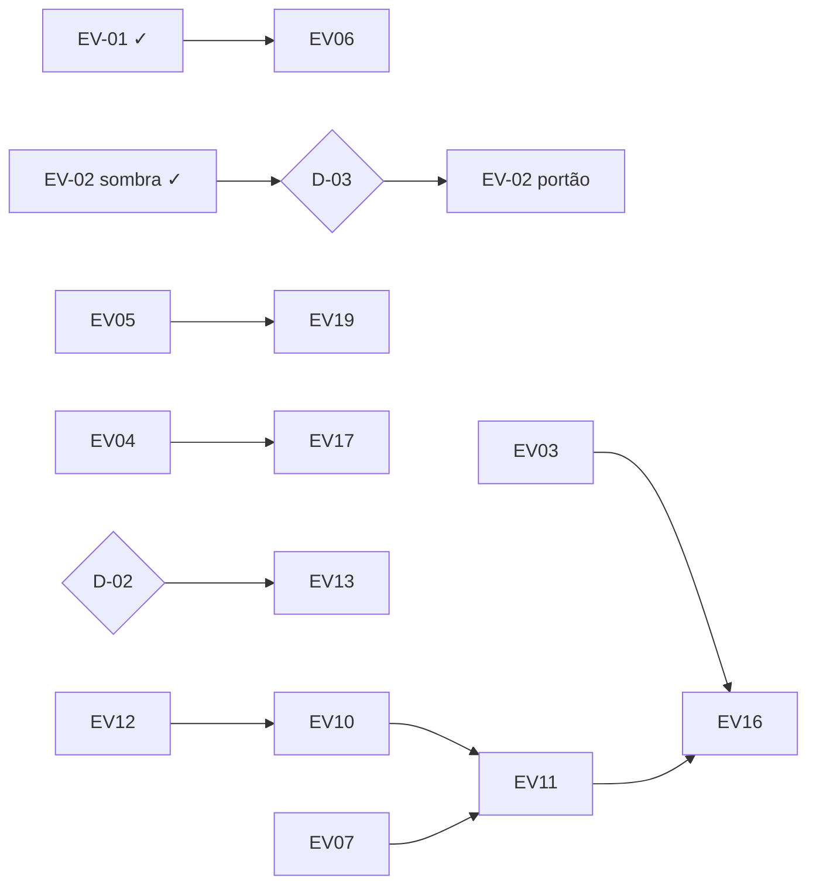

# Roadmap de evolução

Data: 04/10/2026. Iniciativas priorizadas a partir de `AUDIT-REPORT.md`. Cada uma tem entrega verificável e pode ser revertida sozinha. A ordem de execução e o rollback estão em `MIGRATION-PLAN.md`.

## 1. Decisões do dono

Pedem resposta do dono porque mudam o produto ou o risco jurídico. O trabalho que não depende delas segue.

| ID | Pergunta | Recomendação | Bloqueia |
|---|---|---|---|
| **D-01** | A R36 (Pergunte responde sem fonte) continua valendo depois de ver a alternativa de `EDITORIAL-POLICY.md` §6? | Adotar a alternativa: com 1 fonte responde atribuído; com 0 mostra busca e alerta; nunca afirma sem fonte | UI-T13 |
| **D-02** | Reprodução de imagem de terceiros sem permissão: mantém, restringe ou suspende até a revisão jurídica (B-002)? | Manter só com as restrições de `MEDIA-POLICY.md` §4.2 (nunca `og:image`, sem recorte, prazo de 24 h medido) e fazer a revisão jurídica | EV-13 |
| **D-03** | Linhagens independentes passam a valer nas regras (no lugar de veículos distintos) depois de 2 semanas em sombra? | Sim, para o portão "grave + não confiável" e para a confiança | EV-02 fase 2 |
| ~~D-04~~ | Modelo de aprovação para operação de uma pessoa | **Resolvida pelo dono em 04/10 (A-128, PR #37):** fim da regra de duas pessoas em todas as mudanças críticas; uma pessoa com o papel de aprovar pede, aprova e aplica numa ação só, com `approvals` e auditoria registrando quem fez (migration 0149). | — |
| **D-05** | À noite, conflito confirmado e conteúdo duvidoso vão ao revisor automático ou esperam pessoa? | Esperar pessoa (é o que a §1 da spec de autonomia diz) | — |
| **D-06** | Texto e imagem gerados ganham rótulo discreto no público ("Ilustração gerada"; menção em "Como funciona" reaberta)? | Sim para imagem gerada (quando houver gerador); para texto, reabrir a página de método | ligar gerador de imagem |

## 2. Iniciativas

Complexidade: **P** pequena (≤ 1 dia), **M** média (2–5 dias), **G** grande (> 1 semana).

### P0 · crítico

**EV-01 · Revisor nunca decide rascunho sem IA** · Concluída nesta auditoria
- Problema: P0-01. Causa raiz: `isReviewable` e `review_due_articles` não olhavam `ai_fallback`; o contexto do revisor omitia conflito e duvidoso.
- Solução: filtro no código e no SQL (migration 0150); contexto com os dois sinais.
- Arquivos: `src/lib/pipeline/steps/auto-reviewer.ts`, `supabase/migrations/0150_reviewer_skips_ai_fallback.sql`.
- Aceite: rascunho sem IA não aparece em `review_due_articles` e `isReviewable` o recusa; o system prompt do revisor contém os dois sinais.
- Testes: `auto-reviewer.test.ts` (2 novos), `aut-t6-reviewer.test.ts` (1 novo, integração). Pendente: aplicar 0150 em produção.

**EV-02 · Linhagens independentes** · Fase 1 concluída (sombra)
- Problema: P0-02. Causa raiz: `independentSources = new Set(sourceId).size`.
- Fase 1 (feita): `independentLineages` gravado na decisão do `verify`. Fase 2 (após D-03): `computeConfidence` e o portão `untrusted_grave` usam linhagens; `topics.state` "confirmado" exige 2 linhagens.
- Arquivos: `src/lib/confidence/lineage.ts`, `src/lib/pipeline/steps/verify.ts`; fase 2: `confidence/index.ts`, `rules/index.ts`, `topics/state.ts`, `rules/simulate.ts`.
- Riscos: falso positivo de cópia (textos curtos e oficiais parecidos) reduz autonomia. Mitigação: mínimo de 15 palavras, contenção ≥ 0,8, medir antes.
- Aceite fase 2: simulação de 7 dias mostra a diferença; nenhuma matéria com 2 linhagens perde nível.

**EV-03 · Conferência de afirmações e regras de redação verificadas** · M
- Problema: P0-03; regras de redação só no prompt. Causa raiz: guardas do `write` cobrem citação e cópia, não conteúdo.
- Solução: `checkClaims` puro (`EDITORIAL-POLICY.md` §4); fase sombra (grava em `decisions`), depois derruba parágrafo e sobe nível de risco.
- Arquivos: `src/lib/pipeline/steps/write.ts`, novo `src/lib/editorial/claims.ts`, reaproveita `extractNumbers` de `verify.ts`.
- Riscos: falso negativo com número por extenso ("sessenta milhões"); falso positivo com nome comum. Mitigação: sombra + amostra humana.
- Aceite: fixtures com número trocado, citação inventada, "culpado" sem condenação e menor nomeado são pegos; matéria correta passa.
- Testes: unitários da função; caso no `write`.

**EV-13 · Mídia com base de uso** · M, após D-02
- Problema: P0-04, M-01 a M-05. Solução: `MEDIA-POLICY.md` §4: reprodução fora de `og:image`, sem recorte, prazo de 24 h medido; base de uso no ativo; envio de foto pelo Estúdio.
- Arquivos: `src/lib/seo/metadata.ts`, `src/app/(public)/materia/[slug]/page.tsx`, `src/components/editorial/Photo.tsx`, `src/lib/media/*`, migration de `media_assets`.
- Aceite: matéria com reprodução não emite `og:image` da reprodução; nenhuma reprodução renderizada com recorte; pedido de remoção vencido gera alerta.

### P1 · alto

**EV-04 · Alerta que chega a uma pessoa** · M
- Problema: P1-02. Solução: enviar `notifications` de canal `oncall_email` por provedor de e-mail atrás de porta (falso em teste); rastreio de erros do servidor (ler `SENTRY_DSN` ou equivalente); erros hoje engolidos (`review-tick/route.ts:22`, publicação agendada) passam a gravar `pipeline_events` nível `error`; fonte bloqueada por robots conta como falha visível.
- Aceite: tick atrasado > 45 min, disjuntor disparado e fonte pausada geram e-mail deduplicado em 10 min.

**EV-05 · Avaliação por agente e portão de prompt** · M
- Problema: P1-05. Solução: conjuntos de `AI-ORCHESTRATION.md` §6 como fixtures; execução contra o provedor real sob demanda e semanal; `prompt_publish` exige `eval_runs` aprovado nas últimas 24 h.
- Aceite: publicar prompt sem avaliação aprovada falha com mensagem clara.

**EV-06 · Produção em dia** · P (operação)
- Conferir `publish_breaker` (60/800 × 300/3.000, P1-03); aplicar 0150; conferir a chave do OpenRouter que vence em 28/10 (C13); aplicar 0143 se ainda pendente.

**EV-07 · Deduplicação resiliente** · P
- Problema: embedding no caminho crítico; simhash só do título. Solução: simhash de título + trecho; sem embedding, decide só por simhash e marca `degraded` em vez de travar.

**EV-08 · Acompanhamento e reindexação** · M
- Problema: P1-04 (parte de atualização) e P1-09. Solução: reindexar e revalidar matéria em `updated` depois da reescrita ao vivo; item com fato novo em matéria publicada e não editada gera bloco de atualização datado.

**EV-10 · Índice vetorial** · P
- Problema: P1-06. Solução: migration que tipa `embedding vector(1536)` (dimensão de `EMBEDDING_DIM`) e cria HNSW com `vector_cosine_ops` em `collected_items`, `topics`, `articles`. Exige conferir que nenhuma linha tem outra dimensão.

**EV-12 · Rede de segurança operacional** · M
- Problema: P1-07. Solução: projeto de staging (B-004) ou branch do Supabase para previews; migrations aplicadas pelo CI após merge; backup do bucket `media`, `ads` e `source-logos`; retenção do dump > 7 dias fora do GitHub; registro do teste mensal de restauração.

**EV-18 · Aprovação por direção do risco** · Superada pela A-128 do dono (uma pessoa aprova tudo). Fica como alternativa caso a equipe cresça: duas pessoas só para o que amplia risco.
- Triggers de duas pessoas passam a aceitar espera de 24 h sem segunda pessoa para mudanças que ampliam risco; mudanças que restringem ficam imediatas.

### P2 · médio

| ID | Iniciativa | Compl. |
|---|---|---|
| EV-09 | Custos: reserva atômica de orçamento; `AiStore` reaproveitado na busca; reescrita só com fato novo; teto de itens por chamada do `write`; custo por notícia no Control Center | M |
| EV-11 | Entidades no `classify`; fusão de assuntos; `parent_topic_id`; linha do tempo por assunto | G |
| EV-14 | Higiene: DESIGN.md, `screens.md`, `testing.md` alinhados ao vocabulário vigente; link morto em `content/pt-BR/institutional.ts:108`; remover `pipeline/unpublish.ts`, `pipeline/activate-source.ts`, etapas sem handler; consolidar aprovações; uma medida de "texto curto"; testes de integração pulados com aviso quando não há pilha local | M |
| EV-15 | RSS de saída por editoria; envio da newsletter | M |
| EV-16 | `chooseFormat` puro; formatos comparação de versões, acompanhamento, resumo atribuído | M |
| EV-17 | Fontes: dimensões de reputação e independência com histórico; sonda de retomada de fonte pausada; robots bloqueado visível | M |
| EV-19 | `write`: prompt alinhado às 30 linhas, `max_tokens` 4.096, `mainFact` do `verify` como âncora; `classify`+`locate` numa chamada | P |
| EV-20 | Estúdio: quadro "o que cada fonte diz", relatório matinal do revisor noturno com desfazer, métricas editoriais | M |

### P3 · evolutivo

Descoberta de fontes candidatas por links citados; dossiês por entidade; detecção de tendência e pauta por lacuna; home personalizada com consentimento; vídeo por incorporação com `VideoObject`; conector de banco de imagens; gerador de imagem com rótulo (após D-06).

## 3. Dependências

## 4. Critérios de aceitação transversais

- `pnpm verify` verde e e2e verdes em cada entrega.
- Toda mudança de decisão de publicação passa antes por sombra ou por simulação de 7 dias, com o resultado anexado ao PR.
- Nenhuma mudança renomeia campo de `decisions.output`, nome de etapa ou rota pública.
- Toda decisão nova vira `A-###` com status (ADR-011).

## 5. Relatório de conclusão desta auditoria

**Analisado:** código de `src/` (pipeline, regras, IA, mídia, fontes, busca, Estúdio, Control Center, admin), 78 migrations, workflows, toda a documentação de governança e planejamento, specs e decisões. Cinco mapeamentos independentes por área, com achados críticos conferidos diretamente no código antes de agir.

**Alterado:** ver `AUDIT-REPORT.md` §6. Duas mudanças de código (EV-01 e EV-02 fase 1), uma migration (0150), governança (CLAUDE.md, STATE.md, DECISIONS.md, architecture.md, ADR-010 a ADR-014), operação (`.env.example`, runbook de restauração, aviso em `media-slots.md`) e os 11 documentos desta pasta.

**Validado:** ver a seção "Validação" no PR desta auditoria e o registro A-129 em `.planning/DECISIONS.md`. Testes de integração (inclusive o novo caso da 0150) não rodam neste ambiente, que não tem a pilha Supabase local; rodam no CI.

**Pendente:** decisões D-01 a D-06; aplicar 0150 e conferir o disjuntor em produção (EV-06); EV-03 a EV-20.
