# Plano de migração incremental

Data: 04/10/2026. Como levar o sistema da arquitetura atual (`CURRENT-ARCHITECTURE.md`) à proposta (`TARGET-ARCHITECTURE.md`) sem reescrita, uma etapa por vez, cada uma com verificação e rollback próprios.

## 1. Regras de execução

1. Uma etapa por PR. Nada de duas mudanças de decisão de publicação no mesmo PR.
2. Banco: só migrations novas e aditivas; função alterada é redefinida por inteiro em migration nova (como a 0150); coluna nova com padrão que preserva o comportamento atual; nunca apagar coluna lida pelo código em produção na mesma etapa.
3. Decisão de publicação: sombra ou simulação de 7 dias antes de valer (ADR-012).
4. Contratos: `decisions.output` só ganha campos; nomes de etapa e `dedupe_key` não mudam; rotas públicas não mudam.
5. Produção: migration aplicada depois do deploy do código que a tolera (código antes, banco depois), ou o inverso quando o código depende dela; a ordem vai no PR.
6. Toda etapa tem caminho de volta testado no papel antes de começar.

## 2. Etapas

| # | Etapa | Iniciativas | Mudança de banco | Compatibilidade | Rollback | Risco |
|---|---|---|---|---|---|---|
| 0 | **Correções desta auditoria** | EV-01, EV-02 fase 1, governança | 0150 (redefine `review_due_articles`) | Código novo funciona com a função antiga (recusa em `isReviewable`); função nova funciona com o código antigo | Reaplicar a definição de 0141; reverter o commit | Baixo |
| 1 | **Produção em dia** | EV-06 | aplicar 0150 (e 0143 se pendente); conferir `publish_breaker` | — | Ver etapa 0 | Baixo |
| 2 | **Documentos alinhados** | EV-14 (parte de texto) | nenhuma | — | Reverter commit | Nenhum |
| 3 | **Alertas** | EV-04 | nenhuma (canal já existe) | Envio atrás de porta; sem provedor configurado, comportamento atual | Remover a variável do provedor | Baixo |
| 4 | **Avaliações** | EV-05 | `prompt_publish` passa a checar `eval_runs` | Prompt em produção não muda; só a próxima publicação exige avaliação | Redefinir `prompt_publish` anterior | Baixo |
| 5 | **Afirmações em sombra** | EV-03 fase 1 | nenhuma (grava em `decisions.output`) | Nenhuma decisão muda | Reverter commit | Baixo |
| 6 | **Limpeza de código morto** | EV-14 (código) | nenhuma | Remover só o que não tem importador de produção (`unpublish.ts`, `activate-source.ts`, etapas sem handler) depois de conferir que não há mensagem dessas etapas em `jobs`/`pipeline_quarantine` | Reverter commit | Baixo |
| 7 | **Deduplicação e índice vetorial** | EV-07, EV-10 | `alter column embedding type vector(1536)` + HNSW | Conferir antes `select vector_dims(embedding), count(*) … group by 1`; rodar em janela de baixo tráfego | `drop index`; voltar o tipo para `vector` | Médio |
| 8 | **Linhagens como portão** | EV-02 fase 2 (após D-03) | nova versão de `rules` com `independence: "lineage"` | Regra antiga sem o campo continua contando veículos (`parseRuleRow` com padrão) | Ativar a versão anterior das regras (`rules_rollback`) | Médio |
| 9 | **Afirmações como portão** | EV-03 fase 2 | idem, campo em `rules` | idem | `rules_rollback` | Médio |
| 10 | **Mídia** | EV-13 (após D-02) | colunas `basis`, `removal_due_at`, `usage_scope` em `media_assets` com padrão derivado de `kind` | Leitura antiga ignora colunas novas | Colunas ficam; código volta | Médio |
| 11 | **Acompanhamento automático** | EV-08 | nenhuma ou coluna de bloco de atualização | Só para matéria automática não editada | Flag `auto_follow_up` desligada | Médio |
| 12 | **Aprovação por risco** (superada pela A-128 do dono; não executar) | EV-18 | redefine `guard_proposal` e `approval_apply` | Segunda pessoa continua aceita | Redefinir as funções de 0048 | Médio |
| 13 | **Staging e CI de migrations** | EV-12 | nenhuma | Paralelo ao fluxo manual até o primeiro sucesso | Voltar ao manual | Baixo |
| 14 | **Entidades, fusão, formatos** | EV-11, EV-16 | `topics.parent_topic_id`, tabela de entidades | Aditivo | Flag por formato | Médio |

## 3. Ordem e paralelismo

```mermaid
gantt
  dateFormat  X
  axisFormat %s
  section Agora
  0 Correções da auditoria :done, 0, 1
  1 Produção em dia :1, 2
  2 Documentos :1, 2
  section P1
  3 Alertas :2, 4
  4 Avaliações :2, 4
  5 Afirmações em sombra :2, 4
  6 Limpeza :3, 4
  7 Dedupe + índice :4, 6
  13 Staging :4, 6
  section Depois das decisões
  8 Linhagens portão (D-03) :6, 7
  9 Afirmações portão :6, 7
  10 Mídia (D-02) :6, 8
  11 Acompanhamento :7, 9
  14 Entidades e formatos :8, 11
```

Os números do eixo são ordem relativa, não semanas.

## 4. Verificação por etapa

- Antes: `pnpm verify` verde; para etapas com decisão, simulação de 7 dias (`rules/simulate.ts`) ou dados de sombra anexados ao PR.
- Depois do deploy: conferir no Control Center (Tempo real, Falhas, Custos) por 24 h; para etapas 8 e 9, contar publicadas por hora antes e depois, como a spec de autonomia já pede para a v3.
- Critério de rollback: taxa de erro do pipeline > 2% em 1 h, disjuntor disparado por causa da mudança, ou queda de publicadas por hora > 30% sem motivo editorial.
