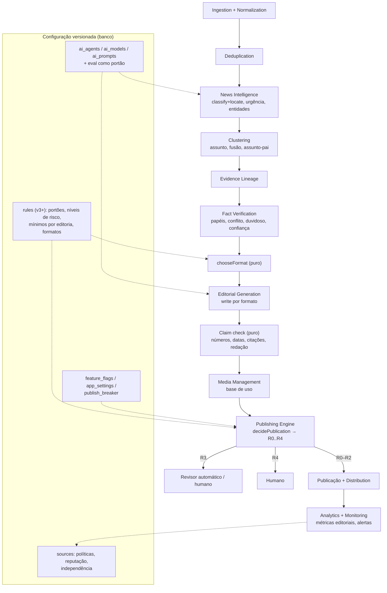

# Arquitetura-alvo

Data: 04/10/2026. Proposta [R] baseada nas evidências de `CURRENT-ARCHITECTURE.md`. **Não é uma reescrita.** O monólito modular em Next.js + Supabase continua (ADR-014); o que muda é a fronteira entre módulos, o que vira dado configurável e três capacidades novas (linhagem, conferência de afirmações, entidades).

## 1. Princípios de desenho

1. **Monólito modular.** Um deploy, um banco. Módulos com contrato explícito (tipos + porta), dependência só para dentro (domínio puro não importa banco nem Next.js). Microsserviço só com motivo medido (carga, isolamento de falha, equipe separada); nenhum existe hoje.
2. **Regra é dado, guarda é código.** O que o dono ou o editor ajustam (limites, pesos, modos, modelos, prompts, formatos) mora no banco, versionado e auditado. O que protege terceiros e a integridade (sanitização, conferência de afirmações, RLS, publicação só por função) é código testado e não se desliga por painel.
3. **Sombra antes de portão.** Toda regra nova de decisão roda primeiro só gravando o que faria (ADR-012).
4. **Idempotência e rastreabilidade por padrão.** Toda etapa grava `decisions` com hash de entrada, versão do prompt e versão das regras. Mantido.
5. **Provedor substituível.** IA, e-mail, push, imagem e banco de imagens atrás de portas com implementação falsa para teste.

## 2. Módulos

| Módulo | Responsabilidade | Hoje | Ação |
|---|---|---|---|
| Source Registry | cadastro, políticas, termos, saúde, confiança | `lib/sources`, `sources.*` | **Manter**; acrescentar dimensões de reputação e independência (`EDITORIAL-INTELLIGENCE.md` §2) |
| Source Discovery | achar fontes candidatas | descoberta por link colado | **Criar** (P3): candidatas a partir de links citados nas matérias coletadas; sempre aprovação humana |
| Content Ingestion | tick, fetch, validate, extract, robots, SSRF | `lib/pipeline` (etapas 1–4) | **Manter** |
| Normalization | URL canônica, `collected_items`, `enrich` | `steps/normalize.ts`, `enrich.ts` | **Manter** |
| Deduplication | duplicata exata e quase exata | `steps/dedupe.ts` | **Refatorar**: simhash do título + trecho; degradar para simhash quando embedding falhar |
| Evidence Lineage | quem copia quem | `confidence/lineage.ts` (sombra) | **Criado** nesta auditoria; promover a portão após D-03 |
| Semantic Clustering | assunto, fusão, assunto-pai | `steps/cluster.ts` | **Refatorar**: fusão de assuntos, `parent_topic_id`, entidade + data como desempate |
| News Intelligence | classificação, local, urgência, entidades, fato principal | `classify`, `locate`, `verify.mainFact` | **Refatorar**: `classify`+`locate` numa chamada; urgência explícita; entidades quando houver consumidor |
| Fact Verification | papéis, conflito, duvidoso, confiança, afirmações | `steps/verify.ts`, `confidence` | **Refatorar**: conferência de afirmações (EV-03) |
| Editorial Generation | formato, texto, título, resumo | `steps/write.ts` | **Refatorar**: `chooseFormat` puro + prompts por formato |
| Media Management | escolha, direitos, armazenamento, remoção | `lib/media` | **Refatorar**: base de uso, envio pelo Estúdio, variantes (`MEDIA-POLICY.md`) |
| SEO Engine | metadados, JSON-LD, sitemaps | `lib/seo`, `auto-checklist.ts` | **Manter**; RSS de saída |
| Editorial Workflow | fila, revisão, revisor automático, correções | `lib/studio`, `review`, `auto-reviewer.ts` | **Manter**; relatório matinal do revisor |
| Publishing Engine | regras, disjuntor, publicação, reescrita | `lib/rules`, `steps/decide.ts`, `publish.ts` | **Manter**; níveis de risco R0–R4 como saída explícita |
| Distribution | push, sitemap, newsletter, RSS | `lib/push`, `newsletter` | **Refatorar**: envio da newsletter e RSS (P2) |
| Analytics | eventos consentidos, ranking, destaques | `lib/events`, `ranking`, `featured` | **Manter**; métricas editoriais |
| Administration | papéis, aprovações, interruptores, contingência | `lib/admin`, `approvals`, `studio` | **Consolidar** as três camadas de aprovações |
| Monitoring | eventos, custos, alertas | `pipeline_events`, `ai_calls`, Control Center | **Refatorar**: alerta fora do banco, rastreio de erros (EV-04) |

**Descontinuar:** `src/lib/pipeline/unpublish.ts`, `src/lib/pipeline/activate-source.ts` (substituídos), nomes de etapa sem handler em `STEP_NAMES`, `pgmq` como dependência declarada (a fila é `jobs`).

## 3. Arquitetura proposta

## 4. Atual × proposta

| Aspecto | Atual | Proposta |
|---|---|---|
| Independência | veículos distintos | linhagens de texto + natureza da fonte |
| Afirmações | citação por parágrafo | citação + conferência de valores e citações |
| Formato | um (matéria de 30 linhas) | escolhido por função pura a partir das evidências |
| Atualização | aviso de fonte nova | acompanhamento datado automático em matéria não editada |
| Assunto | só cria e anexa | cria, anexa, funde, liga a assunto-pai |
| Risco | rota publicar/revisar/reter | nível R0–R4 explícito, com motivo |
| Alertas | só no Control Center | Control Center + e-mail + rastreio de erros |
| Mídia | reprodução como padrão | base de uso registrada; reprodução restrita |
| Prompts | publicados com duas pessoas | duas pessoas + avaliação aprovada |
| Busca vetorial | varredura sequencial | `vector(1536)` + HNSW |

## 5. Critérios de desacoplamento

Um módulo está desacoplado quando:

1. o domínio dele é testável sem banco, sem rede e sem Next.js (padrão já seguido em `rules`, `confidence`, `media/choose`);
2. ele fala com o resto por um tipo de entrada e um de saída declarados (`ports.ts` hoje é um só arquivo de 780 linhas: dividir por módulo);
3. o acesso a banco dele está num store próprio (`pipeline-store.ts` de 1.396 linhas deve virar um store por módulo);
4. trocar o provedor externo dele não muda o domínio;
5. a configuração dele está no banco com versão, e o código tem padrão seguro quando ela falha (como `load.ts` faz com as regras).

## 6. Dependências a preservar

- Contrato da fila (`jobs`, `dedupe_key = <etapa>:<itemRef>`) e nomes de etapa já gravados em mensagens e decisões.
- Formato de `decisions.output` lido pelo Estúdio (`fila/[id]/page.tsx`) e pela simulação de regras (`rules/simulate.ts`): só acrescentar campos, nunca renomear.
- `parseRuleRow` e o comportamento legado (regra sem `neverAuto` mantém os portões antigos).
- Funções `security definer` chamadas pelo Estúdio e pelo pipeline: mudar por nova migration com a definição inteira.
- Vocabulário público imposto por teste.
- Rotas públicas e sitemaps (SEO e links externos).
